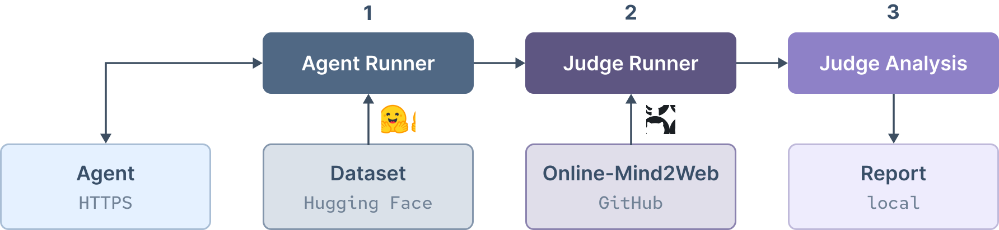

# Online-Mind2Web Runner

[Online-Mind2Web](https://huggingface.co/datasets/osunlp/Online-Mind2Web) [WebJudge](https://github.com/OSU-NLP-Group/Online-Mind2Web) evaluation runner.

Works with any HTTP-based web agent that implements the Online-Mind2Web request-reponse schema.

Pulls the latest dataset (Hugging Face) and runs the original judge implementation (GitHub).

## Setup

``` console
./init.sh
```

Create a `.env` file (compare `.env.example`). Required definitions:

- `HF_TOKEN` – Hugging Face dataset access token.
- `JUDGE_LLM_API_KEY` – OpenAI API key (used by WebJudge).

## Run

<a href="#run"></a>

### 1. Run Agent on Dataset

``` console
python3 -m agent_runner --agent-url <URL>
  [--agent-key <KEY>] [--agent-timeout 600]
  [--tasks <COUNT>]
  [--resume]
```

> Run a mock agent to test the setup.
> 
> ``` console
>  python3 -m mock_agent
> ```

### 2. Run Judge on Agent Results

``` console
python3 -m judge_runner [--resume]
```

### 3. Analyze Judge Results

``` console
python3 -m judge_analysis [--json] [--out <path>]
```

## Web Agent Interface

### Request `POST`

> 🗎 &hairsp; [Dataset Entry Schema](https://huggingface.co/datasets/osunlp/Online-Mind2Web#data-fields)

``` ts
interface Request.POST {
  "task_id": string,
  "task": string,
  "website": string,  // URL
  "reference_length": number
}
```

### Response

> 🗎 &hairsp; [Agent Response Schema](https://github.com/OSU-NLP-Group/Online-Mind2Web/blob/main/data/schema_v2/schema_v2.json) `online-mind2web-v2`

``` ts
// online-mind2web-v2
interface Response {
  "schema_version": "online-mind2web-v2",
  "task": string,
  "task_id": string,
  "reference_length": number,
  "agent_final_answer": string,
  "action_history": {
    "step": number,
    "screenshot": string,  // URL, data-URI, local path or Base64
    "url": string,
    "action": string,      // e.g., "button -> CLICK"
    "action_status"?: string,
    "thought": string
  }[]
}